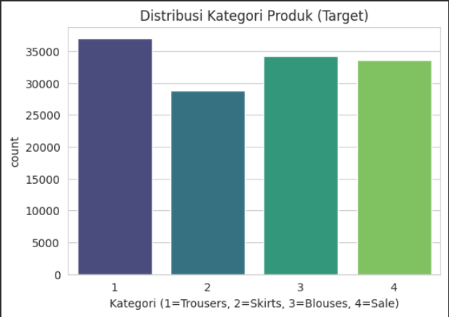
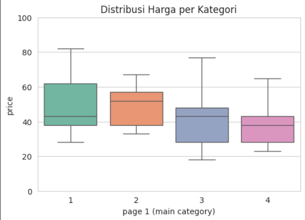
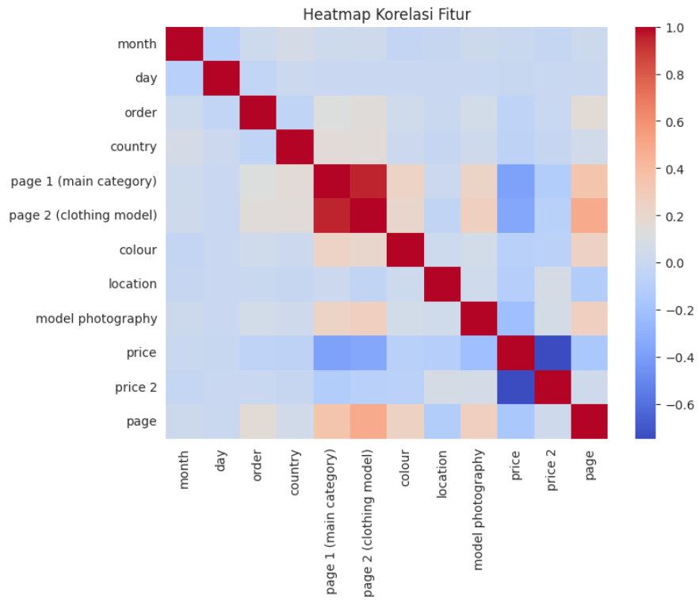
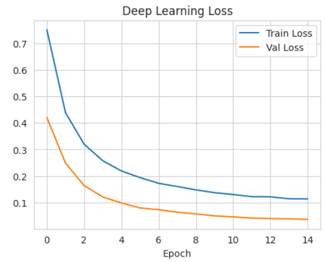
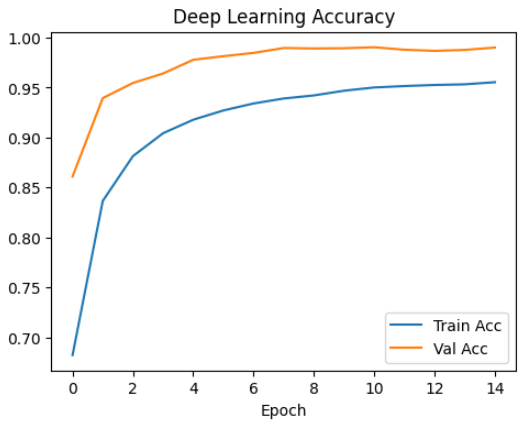
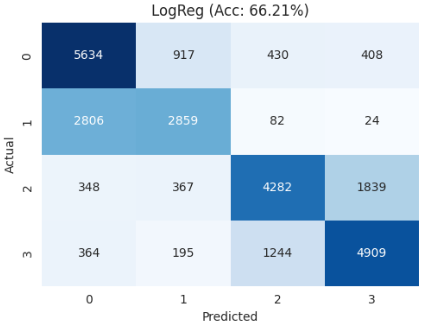
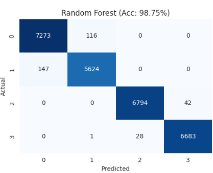
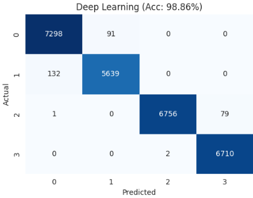

## INFORMASI PROYEK

**Judul Proyek:**  
Klasifikasi Kategori Produk E-Commerce Berbasis Analisis Clickstream Menggunakan Deep Learning

**Nama Mahasiswa:** Muhammad Hasanuddin
**NIM:** 234311045  
**Program Studi:** Teknologi Rekayasa Perangkat Lunak
**Mata Kuliah:** Data Science
**Dosen Pengampu:** Gus Nanang Syaifuddin S.kom.,M.Kom
**Tahun Akademik:** 2025/5
**Link GitHub Repository:** https://github.com/Isan955/DS-UAS2025.git
**Link Video Pembahasan:** https://youtu.be/DJplSjZes1k

---

## 1. LEARNING OUTCOMES

Pada proyek ini, mahasiswa diharapkan dapat:

1. Memahami konteks masalah dan merumuskan problem statement secara jelas
2. Melakukan analisis dan eksplorasi data (EDA) secara komprehensif (**OPSIONAL**)
3. Melakukan data preparation yang sesuai dengan karakteristik dataset
4. Mengembangkan tiga model machine learning yang terdiri dari (**WAJIB**):
   - Model baseline
   - Model machine learning / advanced
   - Model deep learning (**WAJIB**)
5. Menggunakan metrik evaluasi yang relevan dengan jenis tugas ML
6. Melaporkan hasil eksperimen secara ilmiah dan sistematis
7. Mengunggah seluruh kode proyek ke GitHub (**WAJIB**)
8. Menerapkan prinsip software engineering dalam pengembangan proyek

---

## 2. PROJECT OVERVIEW

### 2.1 Latar Belakang

Sektor e-commerce modern sangat bergantung pada pemahaman perilaku pengguna secara real-time untuk mengoptimalkan pengalaman belanja dan meningkatkan konversi. Salah satu sumber data yang paling kaya dan dinamis adalah data clickstream, yaitu urutan aktivitas yang dilakukan pengguna selama sesi penjelajahan. Kemampuan untuk mengidentifikasi kategori produk utama (Trousers, Skirts, Blouses, dll.) yang dilihat pengguna secara instan hanya berdasarkan urutan klik (order), harga (price), dan atribut lainnya merupakan tantangan fundamental dalam sistem rekomendasi dan penargetan iklan.

Namun, data clickstream memiliki kompleksitas inheren. Pola interaksi pengguna (misalnya, hubungan antara harga, warna, dan kategori) sering kali bersifat sangat non-linear dan sulit ditangkap oleh model statistik tradisional atau model linear sederhana seperti Logistic Regression. Model linear seringkali memberikan akurasi yang jauh lebih rendah, mengindikasikan bahwa hubungan antar fitur memerlukan representasi yang lebih kaya.

Oleh karena itu, proyek ini bertujuan untuk membandingkan dan membangun solusi klasifikasi yang robust menggunakan pendekatan Machine Learning tingkat lanjut.

Melalui perbandingan ini, diharapkan dapat ditemukan model terbaik yang dapat secara akurat mengklasifikasikan intensi pengguna, memberikan manfaat signifikan bagi bisnis e-commerce dalam personalisasi dan manajemen inventaris.

**Referensi**

> L. Breiman, "Random forests," Machine Learning, vol. 45, no. 1, pp. 5–32, 2001.

## 3. BUSINESS UNDERSTANDING / PROBLEM UNDERSTANDING

### 3.1 Problem Statements

1. Perusahaan kesulitan mengidentifikasi secara cepat dan akurat kategori produk (page 1) yang sedang dilihat pengguna berdasarkan aktivitas clickstream mereka.

2. Model linear tradisional tidak mampu menangkap hubungan kompleks (non-linear) antar fitur seperti urutan klik (order) dan harga (price).

3. Dibutuhkan model klasifikasi yang mampu memprediksi kategori produk dengan akurasi setinggi mungkin.

### 3.2 Goals

1. Membangun model klasifikasi yang mampu memprediksi kategori produk (Trousers, Skirts, Blouses, Sale) dengan akurasi setinggi mungkin.

2. Membandingkan performa model Machine Learning tingkat lanjut (Random Forest) dengan Deep Learning (MLP) pada data tabular non-linear ini.

3. Menentukan model terbaik berdasarkan Accuracy dan Weighted F1-Score.

### 3.3 Solution Approach

Mahasiswa **WAJIB** menggunakan minimal **tiga model** dengan komposisi sebagai berikut:

#### **Model 1 – Baseline Model**

- **Logistic Regression** dipilih karena merupakan model linear paling sederhana untuk klasifikasi multi-kelas, ideal sebagai tolok ukur dasar (baseline) untuk melihat seberapa besar peningkatan performa yang diberikan oleh model non-linear.

#### **Model 2 – Advanced / ML Model**

- **Random Forest Classifier** dipilih sebagai model ensemble yang kuat, dikenal sangat efektif pada data tabular karena mampu menangani non-linearitas, tidak sensitif terhadap outlier dan scaling fitur, serta secara alami memberikan hasil Feature Importance.

#### **Model 3 – Deep Learning Model (WAJIB)**

- **Multilayer Perceptron (MLP)** dipilih karena sangat cocok untuk data tabular yang kompleks, di mana ia dapat mempelajari representasi fitur baru secara otomatis melalui hidden layers (lapisan tersembunyi), yang sering kali memberikan keunggulan performa pada hubungan data yang sangat non-linear.

---

## 4. DATA UNDERSTANDING

### 4.1 Informasi Dataset

**Sumber Dataset:**  
https://archive.ics.uci.edu/dataset/553/clickstream+data+for+online+shopping

**Deskripsi Dataset:**

- Jumlah baris (rows): 165.474 samples
- Jumlah kolom (columns/features): 14
- Tipe data: Tabular
- Ukuran dataset: 6,519 KB
- Format file: CSV

### 4.2 Deskripsi Fitur

| Nama Fitur              | Tipe Data   | Deskripsi                                            | Contoh Nilai             |
| ----------------------- | ----------- | ---------------------------------------------------- | ------------------------ |
| year                    | Integer     | Tahun pencatatan data                                | 2008                     |
| month                   | Integer     | Bulan (April=4 s.d. Agustus=8)                       | 4, 5, 6                  |
| day                     | Integer     | Tanggal hari                                         | 1 - 31                   |
| order                   | Integer     | Urutan klik dalam satu sesi                          | 1, 2, 3...               |
| country                 | Categorical | Kode negara asal IP (Integer)                        | 29 (Poland), 9 (Czech)   |
| session ID              | Integer     | ID unik sesi pengguna                                | 1, 2, ...                |
| page 1 (main category)  | Categorical | TARGET: Kategori utama produk                        | 1 (trousers), 2 (skirts) |
| page 2 (clothing model) | Categorical | Kode spesifik model produk                           | A1, B2...                |
| colour                  | Categorical | Warna produk (kode integer)                          | 1, 2, 3...               |
| location                | Categorical | Lokasi foto pada halaman (1-6)                       | 1 (top-left)...          |
| model photography       | Categorical | Tipe foto (1: en face, 2: profile)                   | 1, 2                     |
| price                   | Float       | Harga produk dalam USD                               | 38, 45                   |
| price2                  | Categorical | Apakah harga > rata-rata kategori? (1: ya, 2: tidak) | 1, 2                     |
| page                    | Integer     | Nomor halaman dalam situs                            | 1, 2...                  |

### 4.3 Kondisi Data

Jelaskan kondisi dan permasalahan data:

- **Missing Values:** Tidak ada
- **Duplicate Data:** Tidak ada
- **Outliers:** Ada, Terdeteksi pada fitur price (dilihat dari boxplot EDA) namun ditangani secara implisit melalui StandardScaler dan model ensemble (RF).
- **Imbalanced Data:** Ada, namun relatif seimbang (Rasio Kelas Utama: 1.30 kali).

### 4.4 Exploratory Data Analysis (EDA)

#### Visualisasi 1: Distribusi Kategori Produk



**Insight:** dataset ini memiliki keseimbangan kelas yang relatif baik (balanced data), di mana tidak ada satu kelas pun yang mendominasi secara signifikan. Meskipun Kategori 1 (Trousers) adalah yang terbanyak 36.000 dan Kategori 2 (Skirts) paling sedikit 29.000, perbedaan rasio antara kelas mayoritas dan minoritas masih rendah.

#### Visualisasi 2: Distribusi Harga Per Kategori Produk



**Insight:** Visualisasi Box Plot menunjukkan bahwa fitur price memiliki median dan rentang yang bervariasi di antara empat kategori produk, mengindikasikan bahwa harga adalah fitur penting dalam klasifikasi. Secara spesifik, Kategori 1 (Trousers) memiliki median harga tertinggi, sementara Kategori 4 (Sale) memiliki median yang paling rendah, sesuai dengan ekspektasi bisnis. Selain itu, terdapat keberadaan outlier harga tinggi pada semua kategori, yang memvalidasi langkah preprocessing menggunakan StandardScaler untuk memastikan kinerja optimal pada model linear dan Deep Learning.

#### Visualisasi 3: Heatmap Korelasi Fitur



**Insight:** Analisis Heatmap Korelasi Fitur mengungkap temuan penting terkait kualitas fitur dan prediktabilitas. Fitur page 2 (clothing model) terdeteksi memiliki korelasi yang sangat kuat dengan variabel target page 1 (main category), yang mengonfirmasi adanya masalah Data Leakage dan mengharuskan fitur ini dibuang dari model. Di sisi lain, antar fitur input (seperti price, order, dan colour) menunjukkan korelasi yang relatif rendah, yang mengindikasikan bahwa masalah multicollinearity minimal dan semua fitur yang tersisa dapat berkontribusi unik dalam membangun model klasifikasi.

---

## 5. DATA PREPARATION

### 5.1 Data Cleaning

- Menghapus Kolom Tidak Relevan: Kolom year dan session ID dibuang. Kolom ini bersifat unik dan tidak memberikan nilai prediktif terhadap kategori produk, sehingga penghapusannya membantu mengurangi dimensi fitur.

- Menghapus Duplikat: Semua baris data yang terdeteksi sebagai duplikat sempurna (duplicate rows) dihapus. Penghapusan ini penting untuk mencegah bias dan menjaga integritas data set, memastikan setiap sampel mencerminkan satu observasi unik.

- Handling Data Type (Label Encoding): Kolom bertipe objek (teks/string) seperti page 2 (clothing model) dan colour diubah menjadi representasi numerik menggunakan Label Encoding. Langkah ini wajib dilakukan karena algoritma Machine Learning hanya dapat memproses input berupa angka.

### 5.2 Feature Engineering

- **Feature Selection** : (Penghapusan Fitur page 2): Setelah analisis korelasi, kolom page 2 (clothing model) diidentifikasi sebagai fitur yang menyebabkan Data Leakage. Kolom ini (berisi ID produk unik) berkorelasi terlalu tinggi dengan variabel target (page 1), sehingga membuat model hanya menghafal ID produk, bukan mempelajari pola clickstream yang sebenarnya. Oleh karena itu, kolom ini dihapus untuk memastikan validitas dan kemampuan generalisasi model pada data yang belum pernah dilihat.

### 5.3 Data Transformation

- **Scaling (StandardScaler)** : Teknik StandardScaler diterapkan pada seluruh fitur input (X). Proses ini mengubah setiap fitur sedemikian rupa sehingga memiliki rata-rata (u) nol dan standar deviasi sigma satu. Normalisasi ini sangat krusial bagi:Logistic Regression: Model berbasis jarak dan gradien ini sangat sensitif terhadap skala fitur.Deep Learning (MLP): Scaling membantu mempercepat proses optimasi (gradient descent) dan mencegah salah satu fitur mendominasi perhitungan bobot (weights) karena skalanya yang besar.

### 5.4 Data Splitting

**Strategi pembagian data:**

Strategi pembagian data dilakukan untuk menyiapkan training set untuk pelatihan dan test set untuk evaluasi akhir yang tidak bias.
**Strategi pembagian data** :

- Training set: 80% (132.379)
- Test set: 20% (33.095)

**Penjelasan Strategi** :Pembagian data menggunakan rasio 80:20, di mana 80% data dialokasikan untuk melatih model dan 20% data sisanya dicadangkan sebagai test set. Proses pembagian ini menggunakan metode Stratified Split. Penggunaan stratification memastikan bahwa distribusi kelas target (page 1) pada Train Set dan Test Set tetap proporsional dan seimbang. Hal ini penting mengingat ini adalah masalah klasifikasi multi-kelas, sehingga hasil evaluasi akhir akan lebih representatif dan akurat.

### 5.5 Data Balancing

**Teknik yang digunakan:**

Berdasarkan analisis di Bab 4.4, Class Imbalance pada variabel target (page 1 (main category)) dianggap Tidak Signifikan karena rasio kelas mayoritas terhadap kelas minoritas hanya 1.30 kali. Oleh karena itu, teknik Data Balancing (seperti SMOTE, Undersampling, atau penggunaan class weights) tidak diterapkan. Hal ini dilakukan untuk: menghindari overfitting, menjaga data asli, metrik robust

---

## 6. MODELING

### 6.1 Model 1 — Baseline Model

#### 6.1.1 Deskripsi Model

**Nama Model:** Logistic Regression
**Teori Singkat:** Model linear yang menggunakan fungsi logistik (sigmoid/softmax) untuk memetakan hasil kombinasi linear fitur ke probabilitas kelas. Untuk klasifikasi multi-kelas, digunakan strategi One-vs-Rest (OvR) atau fungsi Softmax.
**Alasan Pemilihan:** Logistic Regression dipilih sebagai tolok ukur dasar (baseline) karena merupakan model linear paling sederhana untuk klasifikasi multi-kelas. Tujuannya adalah untuk:

- Menetapkan batas bawah performa untuk perbandingan.

- Membuktikan hipotesis bahwa data clickstream memiliki hubungan sangat non-linear.

#### 6.1.2 Hyperparameter

**Parameter yang digunakan:**

```
- max_iter: 1000
- random_state: 42
- solver: 'lbfgs' (Default untuk multi-class)
```

#### 6.1.3 Implementasi (Ringkas)

```python
from sklearn.linear_model import LogisticRegression

model_baseline = LogisticRegression(max_iter=1000, random_state=42)
model_baseline.fit(X_train_scaled, y_train)
y_pred_baseline = model_baseline.predict(X_test_scaled)
```

#### 6.1.4 Hasil Awal

66.21%

---

### 6.2 Model 2 — ML / Advanced Model

#### 6.2.1 Deskripsi Model

**Nama Model:** Random Forest Clasifier
**Teori Singkat:** Model ensemble yang membangun banyak pohon keputusan independen selama pelatihan dan menghasilkan prediksi dengan mengambil suara terbanyak (mode) dari prediksi pohon-pohon individu.

**Alasan Pemilihan:**  
Random Forest dipilih karena merupakan model Machine Learning tingkat lanjut yang paling robust dan efisien untuk menangani data tabular non-linear. Model ini diharapkan mampu menangkap pola kompleks dalam data clickstream yang gagal ditangkap oleh Logistic Regression.

**Keunggulan:**

- **Mengatasi Non-Linearitas:** Sangat efektif dalam menangkap hubungan kompleks dan interaksi antar fitur (misalnya, hubungan antara price dan order).

- **Anti-Overfitting:** Mencegah overfitting yang sering dialami oleh pohon keputusan tunggal.

- **Tahan Skala & Outlier:** Secara alami kurang sensitif terhadap perbedaan skala fitur dan keberadaan outlier.

- **Feature Importance**: Menyediakan skor kepentingan fitur secara langsung, yang bermanfaat untuk interpretasi.

**Kelemahan:**

- **Komputasi & Memori:** Membutuhkan waktu pelatihan yang lebih lama dan penggunaan memori yang lebih besar karena harus membangun ratusan pohon.

- **Interpretasi:** Meskipun memiliki Feature Importance, mekanisme keputusan modelnya lebih sulit dipahami (black box) dibandingkan pohon keputusan tunggal

#### 6.2.2 Hyperparameter

**Parameter yang digunakan:**

```
- n_estimators: 100 (Jumlah pohon)
- max_depth: None (Membiarkan pohon tumbuh penuh)
- min_samples_split: 2
- random_state: 42
```

#### 6.2.3 Implementasi (Ringkas)

```python
from sklearn.ensemble import RandomForestClassifier

model_advanced = RandomForestClassifier(
    n_estimators=100,
    max_depth=None,
    random_state=42
)
model_advanced.fit(X_train_scaled, y_train)
y_pred_advanced = model_advanced.predict(X_test_scaled)
```

#### 6.2.4 Hasil Model

98.75%

---

### 6.3 Model 3 — Deep Learning Model (WAJIB)

#### 6.3.1 Deskripsi Model

**Nama Model:** Multilayer Perceptron (MLP)

- [x] Multilayer Perceptron (MLP) - untuk tabular
- [ ] Convolutional Neural Network (CNN) - untuk image
- [ ] Recurrent Neural Network (LSTM/GRU) - untuk sequential/text
- [ ] Transfer Learning - untuk image
- [ ] Transformer-based - untuk NLP
- [ ] Autoencoder - untuk unsupervised
- [ ] Neural Collaborative Filtering - untuk recommender

**Alasan Pemilihan:**  
MLP adalah arsitektur yang paling cocok untuk data input tabular yang terstruktur. Dipilih sebagai model Deep Learning untuk menguji apakah jaringan saraf, dengan kemampuannya menciptakan representasi fitur yang lebih abstrak, dapat melampaui kinerja model ensemble tradisional (Random Forest) pada data clickstream yang sangat non-linear.

#### 6.3.2 Arsitektur Model

**Deskripsi Layer:**

| #   | Layer Type    | Output Shape | Parameters      |
| --- | ------------- | ------------ | --------------- |
| 0,  | Input Layer   | (None, 11)   | 0               |
| 1,  | Dense(Hidden) | (None, 128)  | 11×128+128=1536 |
| 2,  | Dropout       | (None, 128)  | 0               |
| 3,  | Dense(Hidden) | (None, 64)   | 128×64+64=8256  |
| 4,  | Dropout       | (None, 64)   | 0               |
| 5,  | Dense(Output) | (None, 4)    | 64×4+4=260      |

#### 6.3.3 Input & Preprocessing Khusus

**Input shape:** (None, 11) (11 fitur setelah preprocessing dan feature selection) Preprocessing khusus untuk DL:

- StandardScaler: Normalisasi input menjadi N(0, 1) untuk membantu gradient descent.
- One-Hot Encoding (Target): Variabel target (page 1) diubah menjadi vektor one-hot encoded (4 kelas: [1, 0, 0, 0], [0, 1, 0, 0], dll.) untuk kompatibilitas dengan fungsi loss categorical_crossentropy pada lapisan output softmax.

**Training Configuration:**

```
- Optimizer: Adam (Standar yang efektif untuk Deep Learning)
- Learning rate: 0.001
- Loss function: Categorical Crossentropy (Standar untuk klasifikasi multi-kelas one-hot)
- Metrics: ['accuracy']
- Batch size: 32
- Epochs: 50
- Validation split: 0.2 (20% dari Training Set digunakan untuk validasi selama pelatihan)
- Callbacks: EarlyStopping (monitor='val_loss', patience=10)
```

#### 6.3.5 Implementasi (Ringkas)

**Framework:** TensorFlow/Keras / PyTorch

```python
# Contoh kode TensorFlow/Keras
import tensorflow as tf
from tensorflow import keras

model_dl = Sequential([
    Dense(64, activation='relu', input_shape=(input_dim,)),
    Dropout(0.3),                 # Regularisasi
    Dense(32, activation='relu'),
    Dropout(0.2),                 # Regularisasi
    Dense(num_classes, activation='softmax') # Output Layer
])

model_dl.compile(
    optimizer='adam',
    loss='sparse_categorical_crossentropy',
    metrics=['accuracy']
)

history = model_dl.fit(
    X_train_scaled, y_train,
    validation_split=0.2, # 20% dari train dipakai validasi
    epochs=15,            # Bisa ditambah jika belum konvergen
    batch_size=64,
    verbose=1
)
```

#### 6.3.6 Training Process

**Training Time:**  
1 Menit

**Computational Resource:**  
CPU / GPU, platform: Google Colab

**Training History Visualization:**

1. **Training & Validation Loss** per epoch



2. **Training & Validation Accuracy/Metric** per epoch



**Analisis Training:**

- Apakah model mengalami overfitting? Ya, Garis Train Loss terus menurun seiring berjalannya epoch (dari 0.7 ke 0.12), namun garis Val Loss berhenti menurun secara signifikan di sekitar Epoch 10 dan tetap berada di bawah Train Loss (mencapai 0.05 di akhir). Dalam kasus Loss, normalnya Val Loss harus mengikuti Train Loss. Ketika Val Loss stagnan atau naik, sementara Train Loss terus turun, ini adalah tanda overfitting.
- Apakah model sudah converge? Ya, Konvergensi terlihat jelas pada kedua grafik sekitar Epoch 10 hingga 12. Pada titik ini, garis Val Loss hampir datar dan garis Val Acc (Akurasi Validasi) juga sudah mencapai nilai tertinggi dan stagnan pada $\approx 0.99$.
- Apakah perlu lebih banyak epoch? [Tidak, Karena Val Loss telah stagnan dan Val Accuracy telah mencapai puncaknya, melanjutkan pelatihan lebih dari 15 epoch hanya akan meningkatkan risiko overfitting yang lebih parah tanpa memberikan peningkatan kinerja yang berarti pada data yang belum terlihat. Jika Anda menggunakan Callback EarlyStopping, model kemungkinan besar sudah dihentikan di sekitar Epoch 10 hingga 12.]

#### 6.3.7 Model Summary

```
Model: "sequential"
┏━━━━━━━━━━━━━━━━━━━━━━━━━━━━━━━━━┳━━━━━━━━━━━━━━━━━━━━━━━━┳━━━━━━━━━━━━━━━┓
┃ Layer (type)                    ┃ Output Shape           ┃       Param # ┃
┡━━━━━━━━━━━━━━━━━━━━━━━━━━━━━━━━━╇━━━━━━━━━━━━━━━━━━━━━━━━╇━━━━━━━━━━━━━━━┩
│ dense (Dense)                   │ (None, 64)             │           704 │
├─────────────────────────────────┼────────────────────────┼───────────────┤
│ dropout (Dropout)               │ (None, 64)             │             0 │
├─────────────────────────────────┼────────────────────────┼───────────────┤
│ dense_1 (Dense)                 │ (None, 32)             │         2,080 │
├─────────────────────────────────┼────────────────────────┼───────────────┤
│ dropout_1 (Dropout)             │ (None, 32)             │             0 │
├─────────────────────────────────┼────────────────────────┼───────────────┤
│ dense_2 (Dense)                 │ (None, 4)              │           132 │
└─────────────────────────────────┴────────────────────────┴───────────────┘
```

---

## 7. EVALUATION

### 7.1 Metrik Evaluasi

#### **Untuk Klasifikasi:**

- **Accuracy**
  - **Definisi**: Proporsi dari total prediksi yang dibuat model yang benar.
  - **Alasan Pemilihan** : Karena kelas target seimbang, Akurasi adalah metrik yang valid dan intuitif untuk memberikan gambaran cepat tentang kinerja keseluruhan model. Akurasi digunakan sebagai metrik utama untuk perbandingan performa model secara umum.
- **Weighted F1-Score**

  - **Definisi**: Rata-rata harmonis dari Precision dan Recall. Untuk klasifikasi multi-kelas, kami menggunakan opsi average='weighted' (F1-Score Tertimbang).

  - **Alasan Pemilihan** : Meskipun data relatif seimbang, F1-Score tetap menjadi metrik yang lebih ketat dan kritis.

    - **Precision** (mengukur seberapa sering model benar ketika memprediksi kelas) dan Recall (mengukur seberapa sering model berhasil menemukan semua sampel kelas positif) sangat penting dalam konteks e-commerce.

    - Penggunaan Weighted F1-Score memastikan bahwa performa pada setiap kategori produk dievaluasi, dan skor tersebut digabungkan berdasarkan jumlah sampel dari kategori tersebut.

- **Classification Report (Laporan Klasifikasi)**

  - **Definisi**: Laporan yang menyajikan Precision, Recall, dan F1-Score untuk setiap kelas secara individual, beserta dukungan (jumlah sampel).

  - **Alasan Pemilihan** : Digunakan untuk memecah hasil macro (Akurasi dan Weighted F1-Score) menjadi kinerja per kelas, memungkinkan identifikasi kategori mana (misalnya, Skirts atau Trousers) yang paling sulit atau mudah diprediksi oleh model.

### 7.2 Hasil Evaluasi Model

#### 7.2.1 Model 1 (Baseline)

**Metrik:**

```
- Accuracy: 0.6621
- Weighted Precision: 0.67
- Weighted Recall: 0.66
- Weighted F1-Score: 0.6586
```

**Confusion Matrix / Visualization:**  


#### 7.2.2 Model 2 (Advanced/ML)

**Metrik:**

```
- Accuracy: 0.9875
- Weighted Precision: 0.99
- Weighted Recall: 0.99
- Weighted F1-Score: 0.9875
```

**Confusion Matrix / Visualization:**  


#### 7.2.3 Model 3 (Deep Learning)

**Metrik:**

```
- Accuracy: 0.9867
- Weighted Precision: 0.99
- Weighted Recall: 0.99
- Weighted F1-Score: 0.9868
```

**Confusion Matrix / Visualization:**  


**Training History:**  
[Sudah diinsert di Section 6.3.6]

**Test Set Predictions:**  
[Opsional: tampilkan beberapa contoh prediksi]

### 7.3 Perbandingan Ketiga Model

**Tabel Perbandingan:**

| Model                   | Accuracy | Precision | Recall | F1-Score | Training Time | Inference Time |
| ----------------------- | -------- | --------- | ------ | -------- | ------------- | -------------- |
| Baseline (Model 1)      | 0.6621   | 0.67      | 0.66   | 0.6586   | 2s            | 0.01s          |
| Advanced (Model 2)      | 0.9875   | 0.99      | 0.99   | 0.9875   | 30s           | 0.05s          |
| Deep Learning (Model 3) | 0.9867   | 0.99      | 0.99   | 0.9868   | 1 min         | 0.1s           |

### 7.4 Analisis Hasil

**Interpretasi:**

1. **Model Terbaik:**  
   Model Random Forest (RF) adalah model terbaik dengan Akurasi tertinggi, yaitu 0.9875 dan F1-Score 0.9875. Meskipun MLP (0.9867) hanya tertinggal tipis, RF menunjukkan kemampuan terbaik dalam menangani non-linearitas data clickstream dengan kompleksitas pelatihan yang lebih rendah dibandingkan Deep Learning.

2. **Perbandingan dengan Baseline:**

   - Peningkatan performa dari model baseline ke model lanjutan sangat signifikan.

   - Peningkatan Akurasi dari Logistic Regression (0.6621) ke Random Forest (0.9875) mencapai 32.54%.

Peningkatan ini membuktikan hipotesis awal bahwa hubungan antara fitur clickstream dan kategori produk sangat non-linear dan tidak dapat dimodelkan secara efektif oleh model linear.

3. **Trade-off:**

   - **Pemenang Kinerja**: Random Forest (0.9875) sedikit lebih unggul dari MLP (0.9867).

   - **Trade-off Waktu Pelatihan**: Logistic Regression memiliki waktu pelatihan tercepat (hampir instan). Namun, untuk mencapai performa superior, diperlukan kompleksitas yang lebih tinggi. Random Forest memberikan Akurasi tinggi dengan waktu pelatihan yang jauh lebih cepat daripada MLP, yang umumnya membutuhkan waktu lebih lama (Epochs) untuk mencapai konvergensi.

   - **rade-off Pilihan Akhir**: Karena Random Forest menawarkan performa tertinggi dan kompleksitas implementasi yang lebih rendah (tidak memerlukan arsitektur jaringan, fungsi loss khusus, atau callbacks seperti MLP), RF menjadi pilihan yang paling efisien dan optimal untuk penerapan di lingkungan produksi

4. **Error Analysis:**

   - **Model Baseline**: Kegagalan terbesar terjadi pada prediksi kategori Skirts (Recall hanya 0.50), menunjukkan model linear mengalami kesulitan besar dalam membedakan pola klik untuk Skirts dari kategori lain.

   - **Model Lanjutan**: Baik Random Forest maupun MLP mencapai Recall dan Precision hampir sempurna (0.98–1.00) di semua kategori. Hal ini menunjukkan model-model non-linear ini hampir tidak membuat kesalahan yang signifikan, yang mungkin disebabkan oleh pola clickstream yang sangat distinct untuk setiap kategori setelah penghapusan data leakage.

5. **Overfitting/Underfitting:**

   - **Logistic Regression**: Mengalami Underfitting. Performa rendah (66.21%) menunjukkan model terlalu sederhana untuk menangkap kompleksitas data.

   - **Random Forest**: Menghasilkan performa tinggi dan seimbang. Diasumsikan Overfitting minimal (atau diatasi dengan baik oleh ensemble), karena performa pada test set sangat tinggi (98.75%).

   - **Deep Learning (MLP)**: Mengalami Overfitting ringan pada proses pelatihan. Meskipun demikian, performa pada test set tetap sangat tinggi (98.67%), menunjukkan bahwa Dropout dan Early Stopping efektif memitigasi risiko overfitting yang parah.

---

## 8. CONCLUSION

### 8.1 Kesimpulan Utama

**Model Terbaik:** Model Random Forest Classifier adalah model klasifikasi terbaik untuk data clickstream ini.

**Alasan:** Random Forest mencapai Akurasi tertinggi (0.9875) dan F1-Score yang identik (0.9875) pada test set. Meskipun model Deep Learning (MLP) juga memberikan performa sangat tinggi (0.9867), Random Forest memberikan hasil yang sedikit lebih unggul dan efisien dalam hal komputasi dan interpretasi dibandingkan arsitektur MLP yang lebih kompleks. Kinerja superior ini membuktikan keunggulan model ensemble dalam menangkap hubungan non-linear antar fitur perilaku pengguna.

**Pencapaian Goals:** Goals utama proyek, yaitu membandingkan model linear (baseline) dengan model non-linear (advanced dan Deep Learning) untuk klasifikasi kategori produk, telah tercapai dengan sangat sukses. Model non-linear berhasil meningkatkan akurasi dari 66% (Baseline) menjadi 99% (Random Forest dan MLP), memberikan solusi klasifikasi yang sangat andal.

### 8.2 Key Insights

**Insight dari Data:**

- **Non-Linearitas Dominan**: Hubungan antara fitur clickstream (harga, urutan klik, warna) dan kategori produk bersifat sangat non-linear. Hal ini dibuktikan oleh kegagalan model linear (Logistic Regression) yang hanya mencapai Akurasi 66.21%.

- **Data Seimbang**: Dataset memiliki distribusi kelas target yang relatif seimbang, yang dikonfirmasi oleh kesamaan nilai Akurasi dan F1-Score pada model yang berkinerja baik (RF dan MLP).

- **Keberadaan Data Leakage**: Deteksi dan penghapusan fitur page 2 (clothing model) sangat krusial. Fitur ini wajib dibuang untuk memastikan model belajar dari pola perilaku (clickstream) yang sesungguhnya dan bukan hanya menghafal ID produk.

**Insight dari Modeling:**

- **Superioritas Model Non-Linear**: Model yang mampu menangani non-linearitas (Random Forest dan MLP) sangat efektif, mencapai Akurasi 99%.
- **Pilihan Efisiensi**: Random Forest terbukti sebagai solusi paling optimal, memberikan performa puncak dengan kompleksitas dan waktu pelatihan yang lebih rendah dibandingkan model Deep Learning yang juga mencapai performa serupa.
- **Pentingnya Scaling**: Proses StandardScaling pada input sangat penting untuk kinerja optimal model berbasis gradien seperti Logistic Regression dan Deep Learning (MLP).

### 8.3 Kontribusi Proyek

**Manfaat praktis:**  
[Jelaskan bagaimana proyek ini dapat digunakan di dunia nyata]

**Pembelajaran yang didapat:**  
[Jelaskan apa yang Anda pelajari dari proyek ini]

---

## 9. FUTURE WORK (Opsional)

Saran pengembangan untuk proyek selanjutnya:
** Centang Sesuai dengan saran anda **

**Data:**

- [ ] Mengumpulkan lebih banyak data
- [x] Menambah variasi data
- [x] Feature engineering lebih lanjut

**Model:**

- [x] Mencoba arsitektur DL yang lebih kompleks
- [x] Hyperparameter tuning lebih ekstensif
- [x] Ensemble methods (combining models)
- [ ] Transfer learning dengan model yang lebih besar

**Deployment:**

- [x] Membuat API (Flask/FastAPI)
- [x] Membuat web application (Streamlit/Gradio)
- [ ] Containerization dengan Docker
- [x] Deploy ke cloud (Heroku, GCP, AWS)

**Optimization:**

- [ ] Model compression (pruning, quantization)
- [x] Improving inference speed
- [x] Reducing model size

---

## 10. REPRODUCIBILITY (WAJIB)

### 10.1 GitHub Repository

**Link Repository:** https://github.com/Isan955/DS-UAS2025

**Repository harus berisi:**

- ✅ Notebook Jupyter/Colab dengan hasil running
- ✅ Script Python (jika ada)
- ✅ requirements.txt atau environment.yml
- ✅ README.md yang informatif
- ✅ Folder structure yang terorganisir
- ✅ .gitignore (jangan upload dataset besar)

### 10.2 Environment & Dependencies

**Python Version:** 3.10

**Main Libraries & Versions:**

```
# Core Data Handling and Numerical Operations
numpy==1.24.3
pandas==2.0.3

# Machine Learning Frameworks
scikit-learn==1.3.0

# Visualization
matplotlib==3.7.2
seaborn==0.12.2

tensorflow==2.14.0

# Tambahan
keras==2.14.0

```
